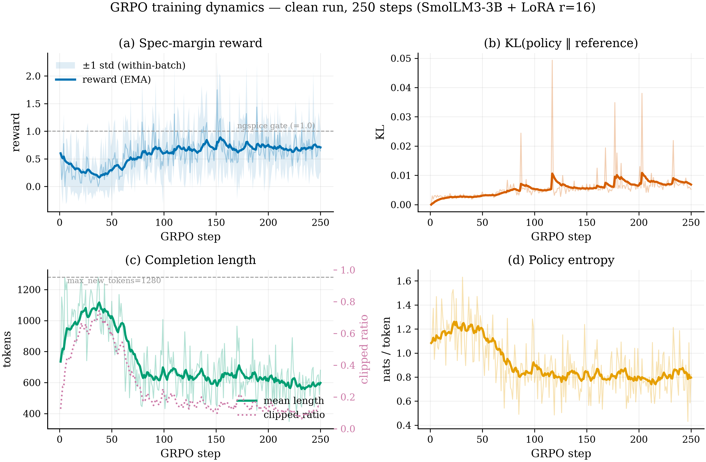
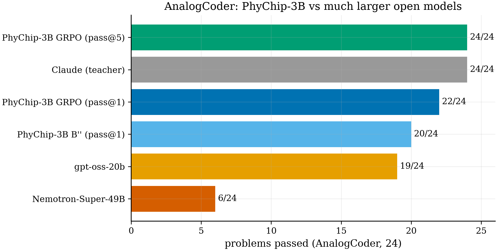
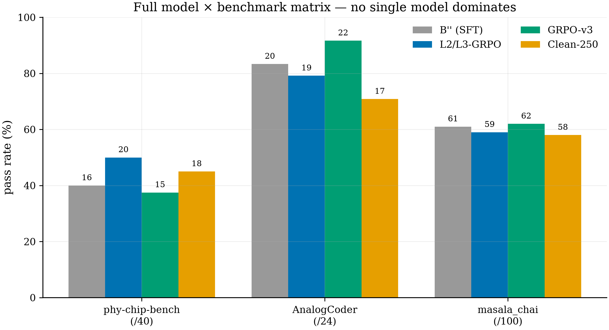
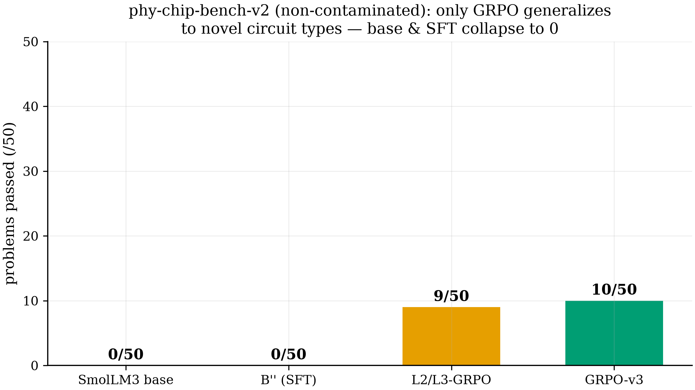
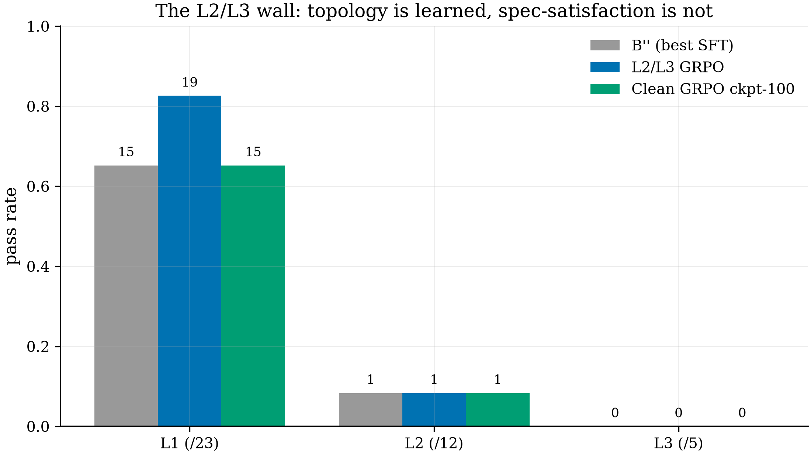

# PhyChip: A Verifiable-Reward Environment for Analog Circuit Design

## Abstract

PhyChip is a reinforcement-learning environment in which a circuit simulator (ngspice)
serves as a deterministic, verifiable reward. A language model reads a natural-language
specification, emits a SPICE netlist, and is rewarded by whether the netlist *simulates*
and *meets the target specification* — measured directly by the simulator, with no learned
reward model in the loop. We train a 3B base model through supervised fine-tuning (SFT)
followed by Group-Relative Policy Optimization (GRPO), and evaluate on an external textbook
benchmark and two purpose-built benchmarks, one of which is contamination-free. RL reaches
**22/24 on AnalogCoder** and is the **only** stage that generalizes to unseen circuit
types. We also harden the reward against adversarial gaming and show that the recipe must
start from a base model, not an instruction-tuned one.

---

## 1. The environment

The core artifact is the environment, not the model. ngspice is wrapped as a reward oracle
with a graded ladder:

| Reward | Condition |
|---|---|
| 0.1 | a SPICE block is present |
| 0.5 | valid syntax + an analysis directive |
| 1.0 | the netlist **simulates cleanly** in ngspice |
| 1.0 + margin | the circuit **meets the target spec** (per-spec margin from a measurement harness) |

**Measurement harnesses.** Each of 23 circuit types has a dedicated harness (102 tests
total) that injects its own trusted testbench and measures the real figure-of-merit (gain,
cutoff frequency, current ratio, line/load regulation, …). A spec is satisfied when the
measured value is within **±30%** of target.

**Anti-cheat.** A naive simulator reward is hackable: a model can reproduce the measured
number with an idealized block (a voltage-controlled source for "gain," a `laplace`
transfer function for a filter response) that contains no real circuit. The environment
defends against this with two mechanisms: (i) each harness **owns its measurement deck** and
ignores any analysis directives supplied by the candidate, and (ii) a topology guard rejects
behavioral shortcuts (`laplace`, `tf`) and requires the physical devices that actually
compute the function (e.g. a transistor for a gain stage, two capacitors for a Sallen-Key
filter). See §6.

**Determinism.** Simulator-measured rewards are version-sensitive, so the environment pins
the ngspice version used for training and evaluation; train-time reward and eval-time
grading share a single gate implementation so they cannot drift.

---

## 2. Training method

- **Base model:** SmolLM3-3B-Base. **Adapter:** LoRA (rank 16).
- **Stage 1 — SFT:** supervised fine-tuning on simulator-verified (spec → netlist) pairs;
  every target netlist passes the ngspice gate before inclusion.
- **Stage 2 — GRPO:** Group-Relative Policy Optimization — group-relative advantage with
  **no value critic**. Group size K = 8 rollouts per prompt. The KL penalty to the SFT
  reference is annealed (0.05 → 0.01) so the policy can move off the reference rather than
  staying pinned to it; this was the change that let RL gains transfer to greedy decoding.

GRPO's GPU utilization is bounded by the CPU-side simulator reward (each step scores K ×
batch independent ngspice runs); parallelizing the verifier across worker threads removes
most of that stall.

---

## 3. Benchmarks and scoring

Every task is graded deterministically: emit netlist (greedy, pass@1) → check it has real
devices + an analysis directive → run in ngspice → harness measures the FOM and checks the
±30% window. **Pass = simulates *and* meets spec.** Headline generalization claims use
pass@k with 2,000× bootstrap 95% confidence intervals.

| Benchmark | Size | Composition | Purpose |
|---|---|---|---|
| **AnalogCoder** | 24 | external, textbook circuits | external capability (eval-only, never trained on) |
| **phy-chip-bench-v1** | 40 | L1=23 topology, L2=12 single-spec, L3=5 multi-spec | in-distribution capability + difficulty ladder |
| **phy-chip-bench-v2** | 50 | 28 novel circuit *types* + 22 held-out variants | generalization; **contamination-free** (max 8-gram overlap 0.018) |

---

## 4. Results

| Benchmark | Best model | Score |
|---|---|---|
| AnalogCoder (24) | GRPO | **22/24 (91.7%)**, 24/24 at pass@5 |
| phy-chip-bench-v1 (40) | GRPO | 20/40 overall; **L1 topology 19/23** |
| phy-chip-bench-v2 (50) | GRPO | **10/50** (vs base/SFT 0/50) |

The 3B model's 22/24 on AnalogCoder exceeds substantially larger open models. No single
checkpoint dominates every axis — RL trades reward-distribution specialization across
benchmarks — but the GRPO model wins the external benchmarks and is the one to ship.

---

## 5. RL generalizes where SFT does not

The contamination-free benchmark is the decisive test: its circuit *types* are absent from
training. There, both the base model and the SFT model score **0/50** — they cannot produce
a working design for a circuit they have never seen — while GRPO reaches **9–10/50**. RL is
the only stage that produces *any* correct unseen circuit.

---

## 6. Is the reward hackable?

We red-teamed the reward with 12 adversarial netlists (two per circuit type) that reproduce
the target figure-of-merit with no legitimate topology — idealized controlled sources,
behavioral output forcing, `laplace`/`tf` transfer blocks, fixed current sources, ideal
clamps.

- The naive reward was fooled by **4/12**.
- With the harness-owned testbench + topology guard (§1), **0/12** succeed.
- **No regression:** every legitimate reference still receives full credit.

This converts the central objection to any verifiable-reward system into a tested,
reproducible result (`athma-train/scripts/grade_reward_hacks.py`).

---

## 7. Base model vs instruction-tuned model

Applying the identical recipe from a base model and from an instruction-tuned model (each
evaluated in its native prompt format) gives opposite outcomes: SFT **lifts the base model
(0 → 16/40)** but **collapses the instruction-tuned model (0 → 0/40)**, which degenerates
into syntactically valid but device-less SPICE. GRPO cannot recover the collapsed model.
This is consistent with the literature on catastrophic forgetting (SFT disrupts a model more
than RL, and the damage scales with the distance between the fine-tuning data and the model's
prior) and yields a clean prescription: **fine-tune the base model.**

---

## 8. Data efficiency

RLVR is prompt-efficient: the policy explores and re-samples each prompt across many
rollouts, sharpening latent ability rather than memorizing. A ~1,300-prompt RL pool sits
in the regime shown to be sufficient in the literature (e.g. [LIMR](https://arxiv.org/abs/2502.11886);
[1-shot RLVR](https://arxiv.org/abs/2504.20571)). The limiting factor for the hardest tier
is not prompt *count* but prompt *learnability* (§9).

---

## 9. Limitations

**Topology is learned; precise numeric spec-satisfaction is the open problem.** On the
difficulty ladder, the model reliably gets the *structure* right (L1 topology up to 83%) but
single- and multi-spec numeric targets (L2/L3) remain hard. The cause is **rollout
sparsity**: on hard specs the policy almost never samples a within-tolerance circuit, so
GRPO has no positive signal to amplify — reward *shaping* alone does not break it. The
promising lever is curriculum selection (train where the model already has non-zero pass
probability). Results here are at LoRA / research scale.

---

## 10. Reproducibility

The environment, trainers, evaluation, benchmarks, and reward-hack grader are in this
repository; the model adapters are on Hugging Face. The simulator version is pinned and the
reward gate is shared between training and evaluation. Released models:
`NithinReddyG/PhyChip-SmolLM3-3B-{base-SFT, base-GRPO-v3, base-L2L3-GRPO, instruct-SFT,
instruct-GRPO-v1, instruct-GRPO-v2}`.
